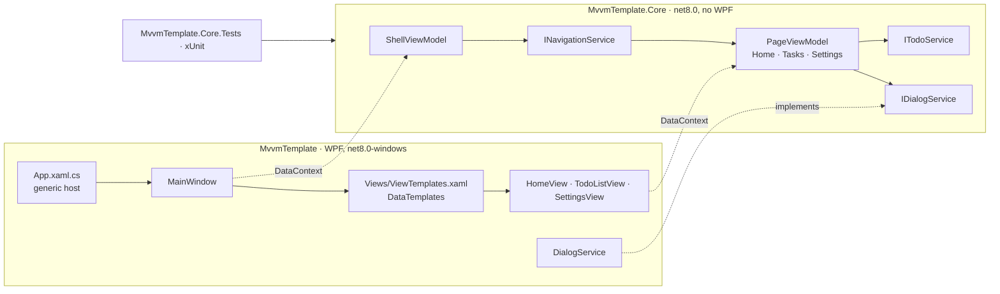

<div align="center">

# MVVMTemplate

**A clean, tested starting point for WPF applications built with the MVVM pattern.**

[](https://github.com/Staery/MVVMTemplate/actions/workflows/ci.yml)


[](LICENSE)

**English** · [Русский](README.ru.md)

</div>

---

MVVMTemplate is a ready-to-run WPF solution that you can clone or install as a `dotnet new` template. It sets up
the parts that every MVVM desktop app needs before the first real feature: dependency injection, navigation between
pages, dialogs, validation, a consistent theme and a unit-test project. It also contains one small sample feature,
a task list, that shows how the parts fit together.

The rule behind the layout is simple: **all logic lives in a plain `net8.0` library with no WPF dependency**, so
every view model can be unit-tested. The WPF project only contains views, styles and thin platform services.

## ✨ What the template provides

| | |
|---|---|
| 🧩 **MVVM with source generators** | [CommunityToolkit.Mvvm](https://learn.microsoft.com/dotnet/communitytoolkit/mvvm/) 8.4: `[ObservableProperty]`, `[RelayCommand]`, async commands, `ObservableValidator` |
| 🏗 **Composition root** | `Microsoft.Extensions.Hosting` generic host: DI container, configuration and logging. The window and all view models come from the container |
| 🧭 **View-model-first navigation** | `INavigationService` creates page view models and keeps a back history; `DataTemplate`s pick the matching view. Pages can receive a parameter |
| 🗂 **Shell with sidebar** | Main window with a menu that stays in sync with the current page, and a header with the page title and a back button (`Alt+←`) |
| 💬 **Dialog abstraction** | View models call `IDialogService`, never `MessageBox`. The WPF implementation can be swapped for custom dialogs |
| ✅ **Validation** | Data annotations plus a custom rule on the sample form. Errors appear under the field and disable the command |
| 📝 **Sample feature** | "Tasks" page: add, complete, delete with confirmation, filter (all/active/completed), search, clear completed |
| ⚙️ **Shared settings** | A singleton `AppSettings` edited on the Settings page and read by the Tasks page |
| 🎨 **Light theme** | Colors, vector icons and styles for buttons, text boxes, combo boxes, check boxes, cards, scroll bars and progress bars |
| 🧪 **Tests** | 63 xUnit tests for navigation, view models, validation, services and DI registrations |
| 🚀 **`dotnet new` template** | `dotnet new wpf-mvvm -n MyApp` renames projects, namespaces and the solution and generates new project GUIDs |
| 🔁 **CI** | GitHub Actions workflow: restore, build and test on `windows-latest` |

## 🧱 Architecture



How a page gets on screen:

1. The user clicks a menu entry. `ShellViewModel.SelectedMenuItem` changes and calls `INavigationService.NavigateTo(pageType)`.
2. `NavigationService` resolves the page view model from the DI container, calls `OnNavigatedFrom()` on the old page
   and `OnNavigatedTo(parameter)` on the new one, then raises `CurrentPageChanged`.
3. The shell's `ContentControl` is bound to `CurrentPage`. WPF finds the `DataTemplate` whose `DataType` matches the
   view model and creates the view; the view model becomes its `DataContext`.

Views never create view models and view models never reference views, so pages can be tested without a UI.

## 📁 Project layout

```
MVVMTemplate/
├── .github/workflows/ci.yml        Build and test on Windows
├── .template.config/template.json  dotnet new template definition
├── Directory.Build.props           Shared settings: C# latest, nullable, implicit usings
├── global.json                     .NET SDK version
├── MvvmTemplate.sln
├── src/
│   ├── MvvmTemplate.Core/          UI-independent library (net8.0)
│   │   ├── Abstractions/           IDialogService
│   │   ├── DependencyInjection/    AddCoreServices(): one place for all registrations
│   │   ├── Models/                 TodoItem, TodoFilter, AppSettings
│   │   ├── Navigation/             INavigationService, NavigationService, NavigationItem
│   │   ├── Services/               ITodoService, InMemoryTodoService
│   │   └── ViewModels/             ViewModelBase, PageViewModel, ShellViewModel and the pages
│   └── MvvmTemplate/               WPF application (net8.0-windows)
│       ├── App.xaml(.cs)           Composition root
│       ├── MainWindow.xaml(.cs)    Shell window
│       ├── Converters/             Visibility and resource lookup converters
│       ├── Services/               DialogService (MessageBox-based)
│       ├── Themes/                 Colors.xaml, Icons.xaml, Controls.xaml
│       └── Views/                  Page views and ViewTemplates.xaml
└── tests/
    └── MvvmTemplate.Core.Tests/    xUnit tests with fakes for UI services
```

## 🚀 Getting started

Requirements: Windows 10/11 and the [.NET 8 SDK](https://dotnet.microsoft.com/download/dotnet/8.0).
Visual Studio 2022 (17.8 or later) and JetBrains Rider both open the solution as is.

### Option 1: clone and run

```bash
git clone https://github.com/Staery/MVVMTemplate.git
cd MVVMTemplate
dotnet run --project src/MvvmTemplate
```

### Option 2: install as a `dotnet new` template

```bash
git clone https://github.com/Staery/MVVMTemplate.git
dotnet new install ./MVVMTemplate

dotnet new wpf-mvvm -n MyApp
cd MyApp
dotnet run --project src/MyApp
```

The template replaces `MvvmTemplate` everywhere (folders, project files, namespaces, the solution, the window title),
generates new project GUIDs and leaves out this README and the license. Run `dotnet new uninstall` to see the exact
command that removes the template again.

## ➕ Adding a new page

Example: a "Reports" page.

**1. Create the view model** in `src/MvvmTemplate.Core/ViewModels/ReportsViewModel.cs`:

```csharp
using CommunityToolkit.Mvvm.ComponentModel;
using CommunityToolkit.Mvvm.Input;
using MvvmTemplate.Core.Services;

namespace MvvmTemplate.Core.ViewModels;

public sealed partial class ReportsViewModel(ITodoService todoService) : PageViewModel("Reports")
{
    [ObservableProperty]
    private int _openTasks;

    public override void OnNavigatedTo(object? parameter) => LoadCommand.Execute(null);

    [RelayCommand]
    private async Task LoadAsync() =>
        OpenTasks = (await todoService.GetAllAsync()).Count(item => !item.IsDone);
}
```

**2. Register it** in `src/MvvmTemplate.Core/DependencyInjection/ServiceCollectionExtensions.cs`:

```csharp
services.AddTransient<ReportsViewModel>();
```

**3. Create the view** `src/MvvmTemplate/Views/ReportsView.xaml` as a `UserControl` (`SettingsView.xaml` is a good
starting point). Its `DataContext` will be the `ReportsViewModel`.

**4. Map the view model to the view** in `src/MvvmTemplate/Views/ViewTemplates.xaml`:

```xml
<DataTemplate DataType="{x:Type vm:ReportsViewModel}">
  <views:ReportsView />
</DataTemplate>
```

**5. Make it reachable.** Add a menu entry in `ShellViewModel` (and, if needed, an icon geometry in
`Themes/Icons.xaml`):

```csharp
new NavigationItem("Reports", "Icon.Tasks", typeof(ReportsViewModel)),
```

or navigate from another view model with `navigation.NavigateTo<ReportsViewModel>();`. An optional parameter
arrives in `OnNavigatedTo`.

**6. Test it** in `tests/MvvmTemplate.Core.Tests`. `TestServices.Create()` returns the real DI container with a fake
dialog service.

## 🧪 Testing

```bash
dotnet test tests/MvvmTemplate.Core.Tests
```

The core library has no WPF dependency, so the tests run on Windows, Linux and macOS. They cover:

- **Navigation:** page creation through DI, parameters, the order of `OnNavigatedTo`/`OnNavigatedFrom`, back history
  and its limit, errors for unregistered or invalid page types.
- **Shell:** menu selection ↔ current page synchronisation, availability of the back command.
- **Tasks page:** loading, adding, validation (required, maximum length, unique title), filtering, search,
  toggling, deleting with and without confirmation, clearing completed tasks.
- **Home and Settings pages:** counters and progress, the greeting by time of day (with a fixed `TimeProvider`),
  navigation with a parameter, settings shared between pages.
- **Services and DI:** the in-memory service and the lifetimes of all registrations.

Building the WPF project itself requires Windows. CI runs the full build and the tests on `windows-latest`.

## 🎨 Customising

- **Branding:** change `AccentColor`/`AccentSecondColor` and the sidebar brushes in `Themes/Colors.xaml`.
- **Real data:** implement `ITodoService` (or your own service) on top of a database or an HTTP client and change one
  line in `AddCoreServices()`.
- **Dialogs:** replace `Services/DialogService.cs` with custom windows or overlays; the interface is already async.
- **Configuration and logging:** the generic host reads `appsettings.json` if you add one next to the executable,
  and `ILogger<T>` can be injected anywhere.

The light theme is adapted from my other project, [StaeryCMS](https://github.com/Staery/StaeryCMS).

## 📝 What changed

Previously this repository contained only a one-line README ("Pattern for designing WPF applications"), a license and
a `.gitignore`, with no code. It now contains a working template:

- a UI-independent core library with base view models, navigation, a dialog abstraction, a sample feature and a
  data service;
- a WPF application with a generic-host composition root, a shell window with a sidebar, view-model-first navigation
  through `DataTemplate`s, a light theme and a `MessageBox`-based dialog service;
- an xUnit test project with 63 tests;
- the `dotnet new` template configuration (`wpf-mvvm`), a solution file, shared build settings, `.editorconfig`,
  `global.json` and a GitHub Actions workflow;
- this README in English and Russian. The license year range was updated to 2023–2026.

## 📄 License

[MIT](LICENSE) © 2023–2026 Staery
