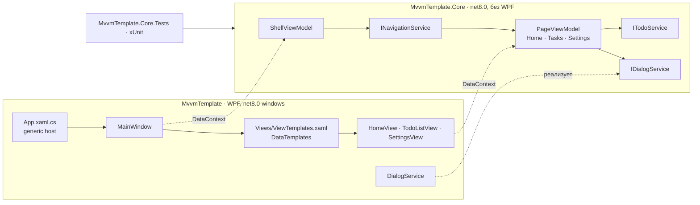

<div align="center">

# MVVMTemplate

**Чистая и покрытая тестами основа для WPF-приложений на паттерне MVVM.**

[](https://github.com/Staery/MVVMTemplate/actions/workflows/ci.yml)


[](LICENSE)

[English](README.md) · **Русский**

</div>

---

MVVMTemplate — готовое к запуску WPF-решение, которое можно склонировать или установить как шаблон `dotnet new`.
В нём уже настроено всё, что нужно любому MVVM-приложению ещё до первой настоящей функции: внедрение зависимостей,
навигация между страницами, диалоги, валидация, единая тема оформления и проект с юнит-тестами. Кроме того, есть
одна небольшая демонстрационная функция — список задач, — на которой видно, как части связаны между собой.

Главное правило структуры: **вся логика находится в обычной библиотеке `net8.0` без зависимости от WPF**, поэтому
любую модель представления можно покрыть юнит-тестами. В WPF-проекте остаются только представления, стили и тонкие
платформенные сервисы.

## ✨ Что даёт шаблон

| | |
|---|---|
| 🧩 **MVVM с генераторами кода** | [CommunityToolkit.Mvvm](https://learn.microsoft.com/dotnet/communitytoolkit/mvvm/) 8.4: `[ObservableProperty]`, `[RelayCommand]`, асинхронные команды, `ObservableValidator` |
| 🏗 **Корень композиции** | Generic host из `Microsoft.Extensions.Hosting`: DI-контейнер, конфигурация и логирование. Окно и все модели представлений создаёт контейнер |
| 🧭 **Навигация «сначала модель представления»** | `INavigationService` создаёт модели страниц и хранит историю для возврата; `DataTemplate` подбирает нужное представление. Странице можно передать параметр |
| 🗂 **Оболочка с боковым меню** | Главное окно с меню, которое синхронизировано с текущей страницей, и заголовок с названием страницы и кнопкой «назад» (`Alt+←`) |
| 💬 **Абстракция диалогов** | Модели представлений вызывают `IDialogService`, а не `MessageBox`. WPF-реализацию можно заменить собственными диалогами |
| ✅ **Валидация** | Атрибуты Data Annotations и собственное правило в демонстрационной форме. Ошибка показывается под полем и блокирует команду |
| 📝 **Демонстрационная функция** | Страница «Tasks»: добавление, отметка о выполнении, удаление с подтверждением, фильтр (все/активные/выполненные), поиск, очистка выполненных |
| ⚙️ **Общие настройки** | Синглтон `AppSettings`: его меняет страница Settings, а читает страница Tasks |
| 🎨 **Светлая тема** | Цвета, векторные иконки и стили для кнопок, полей ввода, выпадающих списков, флажков, карточек, полос прокрутки и индикатора прогресса |
| 🧪 **Тесты** | 63 теста xUnit: навигация, модели представлений, валидация, сервисы и регистрации в DI |
| 🚀 **Шаблон `dotnet new`** | `dotnet new wpf-mvvm -n MyApp` переименовывает проекты, пространства имён и решение и генерирует новые GUID проектов |
| 🔁 **CI** | Workflow GitHub Actions: восстановление пакетов, сборка и тесты на `windows-latest` |

## 🧱 Архитектура



Как страница попадает на экран:

1. Пользователь выбирает пункт меню. Меняется `ShellViewModel.SelectedMenuItem`, и вызывается
   `INavigationService.NavigateTo(pageType)`.
2. `NavigationService` получает модель страницы из DI-контейнера, вызывает `OnNavigatedFrom()` у старой страницы и
   `OnNavigatedTo(parameter)` у новой, затем генерирует событие `CurrentPageChanged`.
3. `ContentControl` оболочки привязан к `CurrentPage`. WPF находит `DataTemplate`, у которого `DataType` совпадает с
   типом модели, и создаёт представление; модель становится его `DataContext`.

Представления не создают модели, а модели не знают о представлениях, поэтому страницы можно тестировать без UI.

## 📁 Структура проекта

```
MVVMTemplate/
├── .github/workflows/ci.yml        Сборка и тесты на Windows
├── .template.config/template.json  Описание шаблона dotnet new
├── Directory.Build.props           Общие настройки: C# latest, nullable, implicit usings
├── global.json                     Версия .NET SDK
├── MvvmTemplate.sln
├── src/
│   ├── MvvmTemplate.Core/          Библиотека без UI (net8.0)
│   │   ├── Abstractions/           IDialogService
│   │   ├── DependencyInjection/    AddCoreServices(): все регистрации в одном месте
│   │   ├── Models/                 TodoItem, TodoFilter, AppSettings
│   │   ├── Navigation/             INavigationService, NavigationService, NavigationItem
│   │   ├── Services/               ITodoService, InMemoryTodoService
│   │   └── ViewModels/             ViewModelBase, PageViewModel, ShellViewModel и страницы
│   └── MvvmTemplate/               WPF-приложение (net8.0-windows)
│       ├── App.xaml(.cs)           Корень композиции
│       ├── MainWindow.xaml(.cs)    Окно-оболочка
│       ├── Converters/             Конвертеры видимости и поиска ресурсов
│       ├── Services/               DialogService (на основе MessageBox)
│       ├── Themes/                 Colors.xaml, Icons.xaml, Controls.xaml
│       └── Views/                  Представления страниц и ViewTemplates.xaml
└── tests/
    └── MvvmTemplate.Core.Tests/    Тесты xUnit с заглушками UI-сервисов
```

## 🚀 Быстрый старт

Нужны Windows 10/11 и [.NET 8 SDK](https://dotnet.microsoft.com/download/dotnet/8.0).
Решение открывается в Visual Studio 2022 (17.8 и новее) и JetBrains Rider без дополнительной настройки.

### Вариант 1: клонировать и запустить

```bash
git clone https://github.com/Staery/MVVMTemplate.git
cd MVVMTemplate
dotnet run --project src/MvvmTemplate
```

### Вариант 2: установить как шаблон `dotnet new`

```bash
git clone https://github.com/Staery/MVVMTemplate.git
dotnet new install ./MVVMTemplate

dotnet new wpf-mvvm -n MyApp
cd MyApp
dotnet run --project src/MyApp
```

Шаблон заменяет `MvvmTemplate` везде (папки, файлы проектов, пространства имён, решение, заголовок окна),
генерирует новые GUID проектов и не копирует этот README и лицензию. Команда `dotnet new uninstall` покажет, как
удалить шаблон.

## ➕ Как добавить новую страницу

Пример — страница «Reports».

**1. Создайте модель представления** в `src/MvvmTemplate.Core/ViewModels/ReportsViewModel.cs`:

```csharp
using CommunityToolkit.Mvvm.ComponentModel;
using CommunityToolkit.Mvvm.Input;
using MvvmTemplate.Core.Services;

namespace MvvmTemplate.Core.ViewModels;

public sealed partial class ReportsViewModel(ITodoService todoService) : PageViewModel("Reports")
{
    [ObservableProperty]
    private int _openTasks;

    public override void OnNavigatedTo(object? parameter) => LoadCommand.Execute(null);

    [RelayCommand]
    private async Task LoadAsync() =>
        OpenTasks = (await todoService.GetAllAsync()).Count(item => !item.IsDone);
}
```

**2. Зарегистрируйте её** в `src/MvvmTemplate.Core/DependencyInjection/ServiceCollectionExtensions.cs`:

```csharp
services.AddTransient<ReportsViewModel>();
```

**3. Создайте представление** `src/MvvmTemplate/Views/ReportsView.xaml` — `UserControl` (удобно начать с копии
`SettingsView.xaml`). Его `DataContext` будет `ReportsViewModel`.

**4. Свяжите модель с представлением** в `src/MvvmTemplate/Views/ViewTemplates.xaml`:

```xml
<DataTemplate DataType="{x:Type vm:ReportsViewModel}">
  <views:ReportsView />
</DataTemplate>
```

**5. Сделайте страницу доступной.** Добавьте пункт меню в `ShellViewModel` (и при необходимости геометрию иконки в
`Themes/Icons.xaml`):

```csharp
new NavigationItem("Reports", "Icon.Tasks", typeof(ReportsViewModel)),
```

или перейдите на неё из другой модели: `navigation.NavigateTo<ReportsViewModel>();`. Необязательный параметр
придёт в `OnNavigatedTo`.

**6. Напишите тесты** в `tests/MvvmTemplate.Core.Tests`. `TestServices.Create()` возвращает настоящий DI-контейнер с
заглушкой сервиса диалогов.

## 🧪 Тестирование

```bash
dotnet test tests/MvvmTemplate.Core.Tests
```

Библиотека ядра не зависит от WPF, поэтому тесты запускаются на Windows, Linux и macOS. Они проверяют:

- **Навигацию:** создание страниц через DI, параметры, порядок вызовов `OnNavigatedTo`/`OnNavigatedFrom`, историю
  возврата и её ограничение, ошибки для незарегистрированных и неподходящих типов.
- **Оболочку:** синхронизацию выбранного пункта меню и текущей страницы, доступность команды «назад».
- **Страницу задач:** загрузку, добавление, валидацию (обязательное поле, максимальная длина, уникальное название),
  фильтрацию, поиск, отметку о выполнении, удаление с подтверждением и без него, очистку выполненных задач.
- **Главную страницу и настройки:** счётчики и прогресс, приветствие по времени суток (с фиксированным
  `TimeProvider`), навигацию с параметром, общие для страниц настройки.
- **Сервисы и DI:** сервис в памяти и время жизни всех регистраций.

Для сборки самого WPF-проекта нужна Windows. CI выполняет полную сборку и тесты на `windows-latest`.

## 🎨 Настройка под себя

- **Фирменный стиль:** поменяйте `AccentColor`/`AccentSecondColor` и кисти боковой панели в `Themes/Colors.xaml`.
- **Настоящие данные:** реализуйте `ITodoService` (или свой сервис) поверх базы данных или HTTP-клиента и измените
  одну строку в `AddCoreServices()`.
- **Диалоги:** замените `Services/DialogService.cs` собственными окнами или оверлеями — интерфейс уже асинхронный.
- **Конфигурация и логирование:** generic host читает `appsettings.json`, если положить его рядом с исполняемым
  файлом, а `ILogger<T>` можно внедрить куда угодно.

Светлая тема адаптирована из другого моего проекта — [StaeryCMS](https://github.com/Staery/StaeryCMS).

## 📝 Что изменилось

Раньше в репозитории были только README из одной строки («Pattern for designing WPF applications»), лицензия и
`.gitignore` — кода не было. Теперь здесь рабочий шаблон:

- библиотека ядра без UI: базовые модели представлений, навигация, абстракция диалогов, демонстрационная функция и
  сервис данных;
- WPF-приложение: корень композиции на generic host, окно-оболочка с боковым меню, навигация через `DataTemplate`,
  светлая тема и сервис диалогов на основе `MessageBox`;
- проект тестов xUnit — 63 теста;
- настройка шаблона `dotnet new` (`wpf-mvvm`), файл решения, общие настройки сборки, `.editorconfig`, `global.json`
  и workflow GitHub Actions;
- этот README на английском и русском языках. Годы в лицензии обновлены до 2023–2026.

## 📄 Лицензия

[MIT](LICENSE) © 2023–2026 Staery
